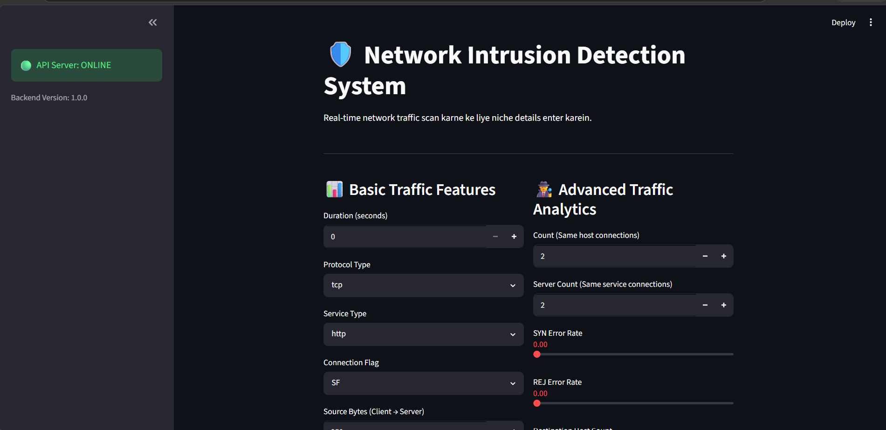
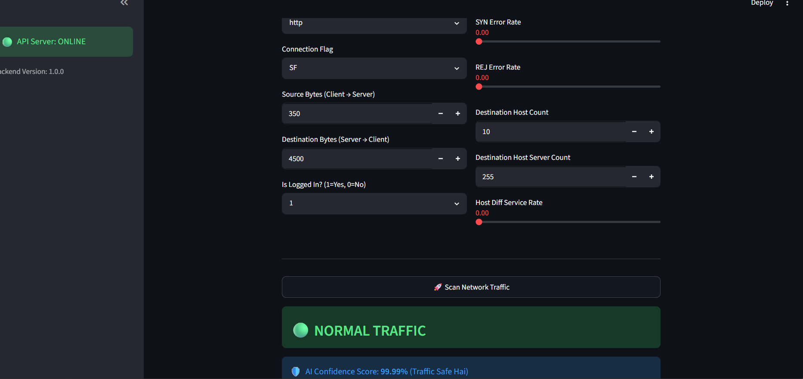
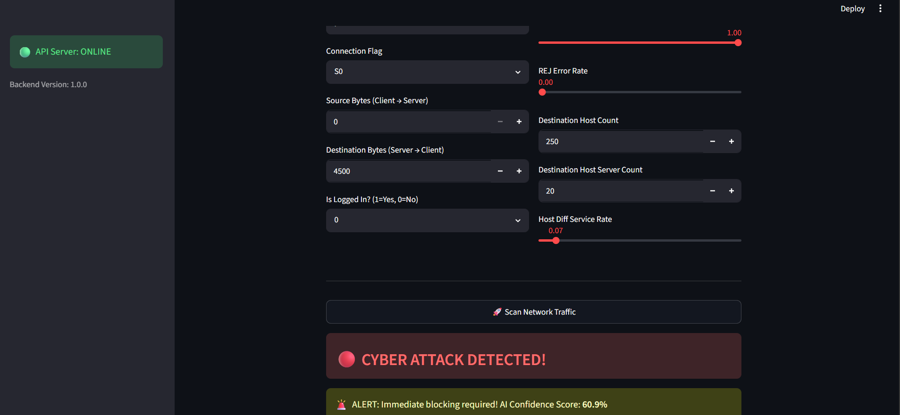

# 🛡️ Network Intrusion Detection System (NIDS) using Machine Learning

## 👤 Internship Demographics
* **Full Name:** Gopal Goswami 
* **Intern ID:** CITS3236
* **Project Name:** Network Intrusion Detection System
* **Domain:**  Machine Learning
* **Duration:** 4 Weeks

---

## 📌 Project Scope & Core Objective
Modern corporate networks handle millions of data packets every second, making manual inspection for malicious payloads impossible. This project delivers a high-performance, AI-driven **Network Intrusion Detection System (NIDS)** designed to scan incoming network traffic parameters and isolate anomalies or cyber threats (like DoS attacks or unauthorized scanning) instantly. 

Powered by an optimized **XGBoost Classifier** trained on the rigorous standard NSL-KDD dataset framework, the solution architecture is cleanly divided into two cohesive segments:
1. **Machine Learning Backend API:** Built using the production-grade **FastAPI** ecosystem, it features an ultra-low latency inference endpoint that processes live network metrics and streams responses back in milliseconds.
2. **Interactive Management Interface:** Developed via **Streamlit**, it renders a responsive web-based security operations center (SOC) dashboard allowing network administrators to test packet frames easily using sliders and select inputs.

---

## ⚙️ Project Architecture & Pipeline Workflow


1. **Exploratory Data Analysis & Transformation:** Evaluated historical packet structures, normalized key variance attributes, and securely mapped high-cardinality nominal text strings (`protocol_type`, `service`, `flag`) into clean numerical indices via standalone `LabelEncoder` pipelines.
2. **Dynamic 41-Feature Mapping Layer:** Real-world packets rarely match training arrays out-of-the-box. To prevent runtime deployment schema crashes, the backend features a robust array expansion script. It maps the 14 vital parameters captured from the frontend onto the absolute 41-column spatial grid structure required by the XGBoost binary. Remaining vacant attributes are automatically assigned stable baseline defaults.
3. **Model Serialization:** Both the finalized gradient-boosted tree model matrix and its corresponding multi-class text encoders are saved as `.pkl` objects using the `joblib` memory persistence library.
4. **Client-Server Contract:** Live parameter transport layers use structured JSON objects transmitted through asynchronous HTTP POST protocols (`requests.post`).

---

## 🚀 Completed Intern Task Milestones

- [x] **Data Cleaning & Pipeline Engineering:** Compiled valid evaluation matrices and streamlined input dimensions.
- [x] **Statistical Vulnerability Analysis:** Studied adversarial traffic behaviors and baseline normal bounds.
- [x] **Predictive Modeling Implementation:** Engineered an enterprise-tier XGBoost classifier yielding exceptional precision and recall scores.
- [x] **Administrative UI Tooling:** Designed an intuitive Streamlit app with integrated visual threat-alert metrics.

---

## 📂 Project Directory Topography
The workspace files are systematically arranged as follows:

```text
Network_Intrusion_Project/
│
├── src/
│   ├── Train.py                 # Core analytical training script & model persistence code
│   ├── intrusion_model.pkl      # Serialized trained XGBoost intelligence binary
│   ├── protocol_type_encoder.pkl# Serialized protocol categorical index mapper
│   ├── service_encoder.pkl      # Serialized service categorical index mapper
│   └── flag_encoder.pkl         # Serialized connection flag index mapper
│
├── main.py                      # FastAPI microservice routing script (Backend API)
├── ui.py                        # Streamlit visual dashboard rendering script (Frontend)
├── requirements.txt             # Unified project package dependencies manifest
└── README.md                    # Comprehensive technical documentation manual (This file)

---

## 📸 Application Screenshots





